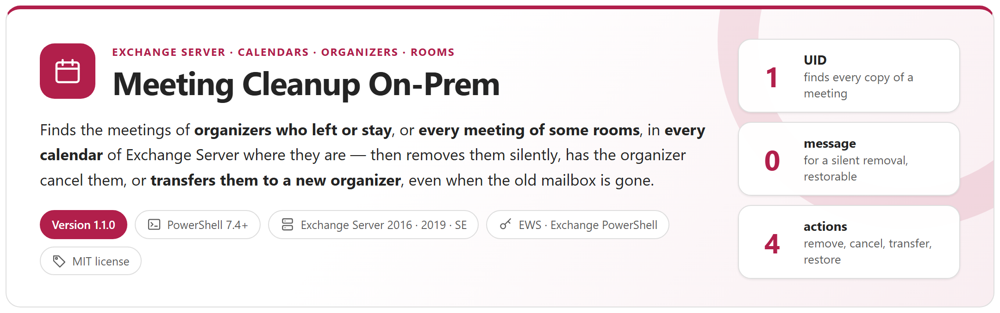
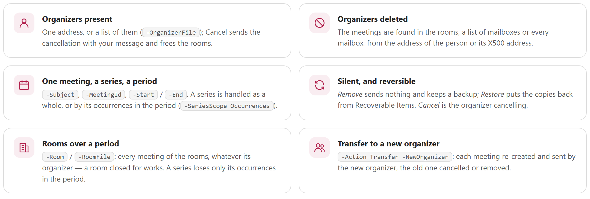
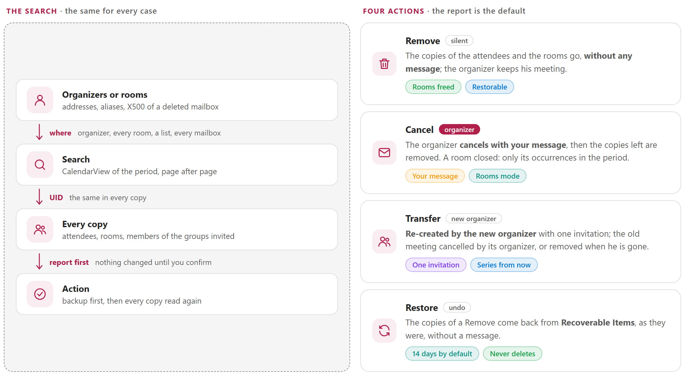
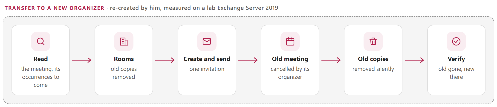

<p align="center">
  <picture>
    <source media="(prefers-color-scheme: dark)" srcset="docs/images/readme-banner-dark.png">
    
  </picture>
</p>

<p align="center">
  <a href="#how-it-works"><b>How it works</b></a> &nbsp;&middot;&nbsp;
  <a href="#the-actions"><b>The actions</b></a> &nbsp;&middot;&nbsp;
  <a href="#transfer-to-a-new-organizer"><b>Transfer</b></a> &nbsp;&middot;&nbsp;
  <a href="#reports"><b>Reports</b></a> &nbsp;&middot;&nbsp;
  <a href="#quick-start"><b>Quick start</b></a> &nbsp;&middot;&nbsp;
  <a href="docs/MeetingCleanupOnPrem-UserGuide.md"><b>User guide</b></a> &nbsp;&middot;&nbsp;
  <a href="docs/MeetingCleanupOnPrem-Guide.md"><b>Developer guide</b></a>
</p>

> [!IMPORTANT]
> Files downloaded from the Internet may be blocked by Windows and fail to run. Before using this project, unblock every file in the downloaded folder:
>
> ```powershell
> Get-ChildItem "C:\Chemin\Du\Dossier" -Recurse -File -Force | Unblock-File
> ```
>
> Replace the example path with the folder where you downloaded or extracted this project.

## Why

Meetings outlive the people and the decisions behind them. A person leaves and their weekly meetings keep booking the rooms; an organizer deletes a meeting without sending the cancellation and it stays in every attendee's calendar; a mailbox is deleted and its meetings can no longer be cancelled by anyone; a room closes for two weeks of works and every meeting booked in it must go. In each case the meeting exists in **many mailboxes** — the organizer, the rooms, the attendees, the members of the groups invited — and each copy has to be found and handled.

This tool does it for **Exchange Server** (2016, 2019, Subscription Edition) with one search for every case, a report first, then a clear choice: remove the copies **silently**, have the organizer **cancel** the meetings, or **transfer** them to a new organizer. A silent removal can be **restored**. It is the on-premises counterpart of [Meeting Cleanup](https://github.com/Nico77600/MeetingCleanup) for Exchange Online: the same search, actions, console and report, through EWS and Exchange PowerShell.

<picture>
  <source media="(prefers-color-scheme: dark)" srcset="docs/images/readme-principles-dark.png">
  
</picture>

## How it works

<picture>
  <source media="(prefers-color-scheme: dark)" srcset="docs/images/readme-how-it-works-dark.png">
  
</picture>

- **Every copy, wherever the meeting is found**: one copy of a meeting holds its whole attendee list. Every internal attendee, room and member of an invited group is then asked for its own copy, by **UID** (the same in every copy). External attendees are listed, not processed.
- **Organizer present or gone**: its calendar when the mailbox exists; every room, a list of mailboxes or every mailbox of the organization when it does not — from the old address or the **X500 address** of the deleted mailbox. A list of organizers is searched in one pass.
- **Rooms over a period** (`-Room`, `-RoomFile`): every meeting of the rooms, whatever its organizer. A series is limited to the occurrences the rooms hold in the period; it goes on before and after.
- **One occurrence of a series** (`-SeriesScope Occurrences`): a series of an organizer limited to its occurrences in the period — with a period of one day, one occurrence. *Cancel* sends one cancellation for that date only; the series goes on.
- **Nothing by surprise**: the report is the default action. Every action shows exactly what it will do and asks to type **YES**; a backup (`Backup.json`) is written before any change; each copy removed is read again to check it is gone. `-FromReport` acts on exactly the meetings of a reviewed report.
- **Large organizations**: each calendar is read once per search, page after page, the details 50 items per call; a request Exchange is too busy to process (throttling) is sent again after the delay it asks for. The console shows a live progress line with the time left.
- **One service account** with ApplicationImpersonation (limited by a management scope), **EWS** called directly and **Exchange PowerShell** opened by the tool (remote PowerShell): no module to install.

## The actions

Measured on a lab Exchange Server 2019 ([developer guide, chapter 4](docs/MeetingCleanupOnPrem-Guide.md#4-the-actions) and appendix C):

| Action | Organizer's meeting | Attendees and rooms | Messages |
|---|---|---|---|
| **Report** (default) | — | — | none: nothing is changed |
| **Remove** | left as it is (*Kept*): the organizer can still cancel it | copies removed (Recoverable Items) | **none** |
| **Cancel** | cancelled with your message, rooms released | copies left removed | the cancellation |
| **Transfer** (`-NewOrganizer`) | re-created by the new organizer; the old one cancelled by its organizer, or removed when he is gone | one new invitation; the old copies removed silently | the invitation of the new organizer, the cancellation of the old one |
| **Restore** (`-FromReport` of a Remove run) | — | copies put back from Recoverable Items, as they were: rooms busy again | **none** |

A removed copy stays restorable for the retention of deleted items (14 days by default). A cancellation cannot be undone: the attendees received it.

## Transfer to a new organizer

`-Action Transfer -NewOrganizer <address>` gives the meetings found to another person. Exchange Server cannot change the organizer of a meeting (Exchange Online has `Invoke-ChangeMeetingOrganizer`, not Exchange Server): the tool **re-creates each meeting in the new organizer's calendar**:

<picture>
  <source media="(prefers-color-scheme: dark)" srcset="docs/images/readme-transfer-dark.png">
  
</picture>

- A series is re-created **from its next occurrence**, with the same pattern and time zone; a numbered series keeps the occurrences still to come.
- The old meeting is cancelled by its organizer with the message *This meeting is now organized by ...*, or its copies are removed silently when his mailbox is gone.
- A failure before the invitation changes nothing more; the old room copies already removed can be restored.
- The report of a transfer opens on its **Transfers** tab: for each meeting, from whom to whom, the new meeting and its invitation, what became of the old meeting and of its copies (`MeetingCleanupOnPrem-Transfers.csv` too).

## Reports

<table>
  <tr>
    <td width="50%" valign="top"><a href="docs/images/report-overview.png"></a><br><sub><b>HTML report</b> &middot; who was searched, where, every meeting and every copy with the answer of Exchange</sub></td>
    <td width="50%" valign="top"><a href="docs/images/console-run.png"></a><br><sub><b>Console</b> &middot; the request and the connection, each step, the meetings found, the files and the next command to run</sub></td>
  </tr>
</table>

<details>
<summary><b>Transfers tab</b> &middot; after a transfer: from whom to whom, the new meeting, the old one and its copies</summary>
<br>
<a href="docs/images/report-transfers.png"></a>
</details>

<details>
<summary><b>A search in progress</b> &middot; the step, the part done and the time left</summary>
<br>
<a href="docs/images/console-progress.png"></a>
</details>

Each run writes `MeetingCleanupOnPrem-Meetings.csv`, `-Copies.csv`, `-Organizers.csv` (and `-Transfers.csv` after a transfer), `-Summary.json`, `-Backup.json` (written before any change) and a self-contained HTML report, in a folder of its own.

## Requirements

| Item | Requirement |
|---|---|
| Exchange | **Exchange Server 2016, 2019 or Subscription Edition**, EWS reachable over HTTPS (validated on Exchange Server 2019). For Exchange Online: [Meeting Cleanup](https://github.com/Nico77600/MeetingCleanup) |
| PowerShell | 7.4 or later — a portable zip is enough |
| Windows | Windows 10 / 11 or Windows Server 2016 to 2025: an administration workstation or an Exchange server; it runs in a console or a scheduled task |
| Service account | The role **ApplicationImpersonation**, limited by a management scope ([developer guide, chapter 5](docs/MeetingCleanupOnPrem-Guide.md#5-rights-and-connection)); `Delegate` (full access) works as well |
| Exchange PowerShell | Recommended (remote PowerShell, opened by the tool): aliases and X500 addresses, every room and every mailbox, groups. Read-only roles of the directory |
| *Restore* | The role **Mailbox Import Export** (`Get-RecoverableItems`, `Restore-RecoverableItems`) |
| Network | HTTPS to the EWS URL; HTTP (Kerberos) to `/PowerShell/` of a Mailbox server |

## Quick start

Download `MeetingCleanupOnPrem-<version>.zip` from the [latest release](https://github.com/Nico77600/MeetingCleanupOnPrem/releases/latest), extract it (for example in `C:\Tools`) and unblock the files (command at the top of this page).

```powershell
cd C:\Tools\MeetingCleanupOnPrem-1.1.0
notepad .\config\MeetingCleanupOnPrem.config.psd1     # EWS URL, service account, Exchange PowerShell server, accepted domains

# Always a report first (nothing is changed), then the same command with the action
.\Invoke-MeetingCleanupOnPrem.ps1 -Organizer megan.bowen@contoso.com
.\Invoke-MeetingCleanupOnPrem.ps1 -Organizer megan.bowen@contoso.com -Action Cancel -Comment 'Megan has left the company.'
.\Invoke-MeetingCleanupOnPrem.ps1 -Organizer john.doe@contoso.com -Action Transfer -NewOrganizer jane.roe@contoso.com
.\Invoke-MeetingCleanupOnPrem.ps1 -Room room-paris-01@contoso.com -Start 2026-11-02 -End 2026-11-13 -Action Cancel -Comment 'Closed for works.'
.\Invoke-MeetingCleanupOnPrem.ps1 -Organizer megan.bowen@contoso.com -Subject 'Weekly sales review' -SeriesScope Occurrences -Start 2026-11-16 -End 2026-11-16 -Action Cancel -Comment 'No sales review this Monday.'
.\Invoke-MeetingCleanupOnPrem.ps1 -Action Restore -FromReport .\reports\MeetingCleanupOnPrem_Remove_20261105-093000
```

One command per everyday question — who still organizes what, a leaver with or without mailbox, a transfer, one series, one occurrence of a series, rooms closed, the leavers of the month, undo a removal, a scheduled task: see the [user guide](docs/MeetingCleanupOnPrem-UserGuide.md).

The zip of each [release](https://github.com/Nico77600/MeetingCleanupOnPrem/releases) contains only the files needed to run, with both guides in HTML; `.\tools\New-MeetingCleanupOnPremPackage.ps1` builds the same package from the repository.

## Documentation

| Guide | Content |
|---|---|
| **[User guide](docs/MeetingCleanupOnPrem-UserGuide.md)** | For the people who run the tool: **prerequisites**, the one-time setup (service account, roles) and **everyday commands only** — which meetings this person still organizes, a person has left (mailbox kept or deleted), give the meetings to someone else, one series without a message, one occurrence of a series, rooms closed for works, the leavers of the month, undo a removal, a scheduled task, the results. |
| **[Developer guide](docs/MeetingCleanupOnPrem-Guide.md)** | Everything else: how it works, every case, each action as measured on a lab Exchange Server (Remove, Cancel, rooms mode, Transfer, Restore), the rights and the connection (impersonation, Windows authentication, remote PowerShell, load balancer), every setting and parameter, the console, the report, the files produced, the architecture, performance and limits, tests, troubleshooting, security. |

Both guides also exist as a single HTML file with a light and a dark theme (`docs/MeetingCleanupOnPrem-UserGuide.html`, `docs/MeetingCleanupOnPrem-Guide.html`): download them and open them locally, or use the copies in the release zip.

## Tests

```powershell
.\Run-Tests.ps1                                                       # Pester 6.1+, a simulated Exchange Server, no network
.\tools\Measure-MeetingCleanupOnPrem.ps1 -Meetings 600 -LatencyMs 20 -Show   # a whole search on a simulated organization
```

The tool was also validated on a lab Exchange Server 2019 (four Mailbox servers behind a load balancer, run by a scheduled task with a service account): reports of organizers and lists, Remove from a reviewed report and Restore without any message, Cancel of single meetings and series, rooms over a period with series, transfers of series and single meetings, calendars read page after page ([developer guide, appendix C](docs/MeetingCleanupOnPrem-Guide.md#appendix-c---lab-measurements)).

## License

[MIT](LICENSE).

## Disclaimer

Personal project, provided as is. It is not an official Microsoft product and is not supported by Microsoft. Removing, cancelling or transferring meetings changes real calendars: always start with a report, and test it in your environment before production use.
