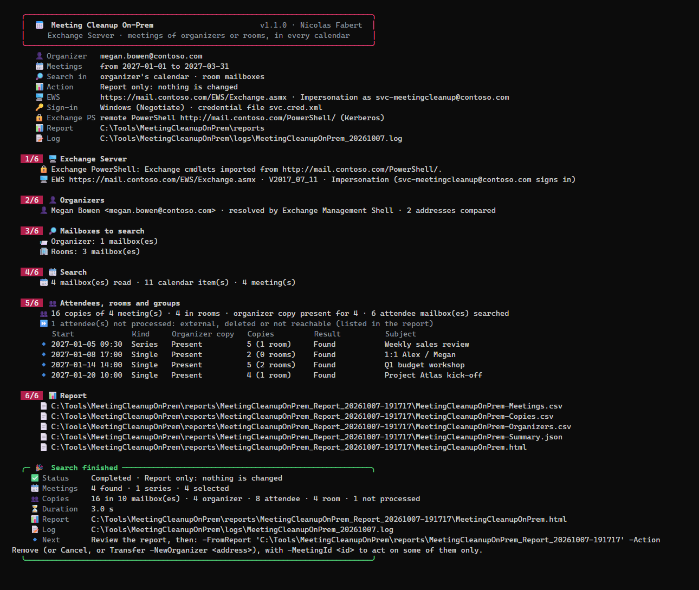
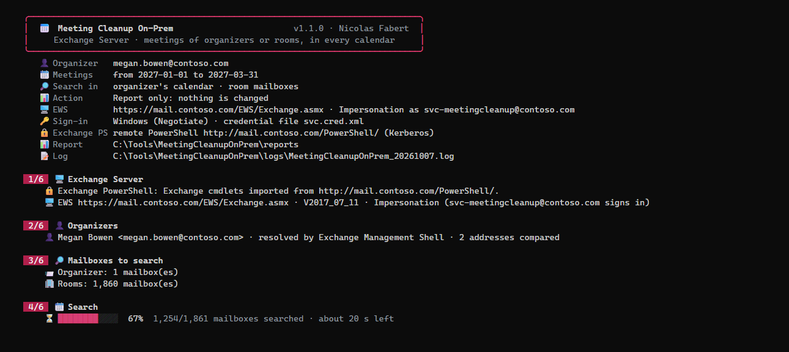
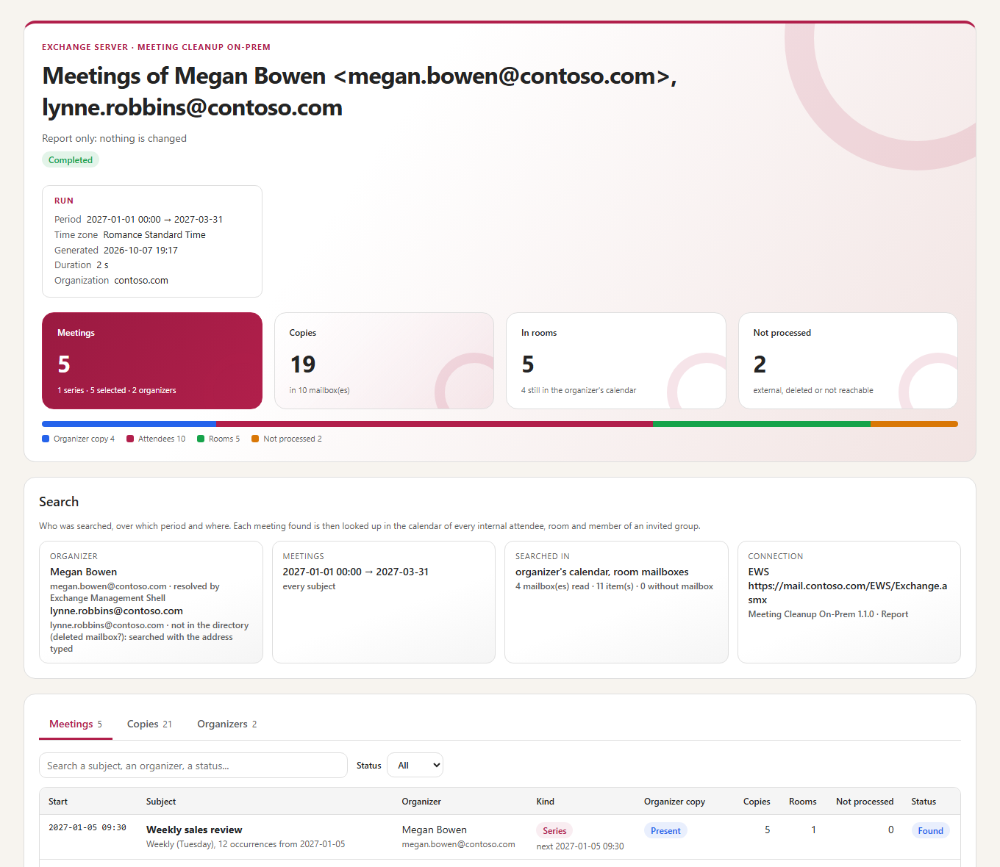
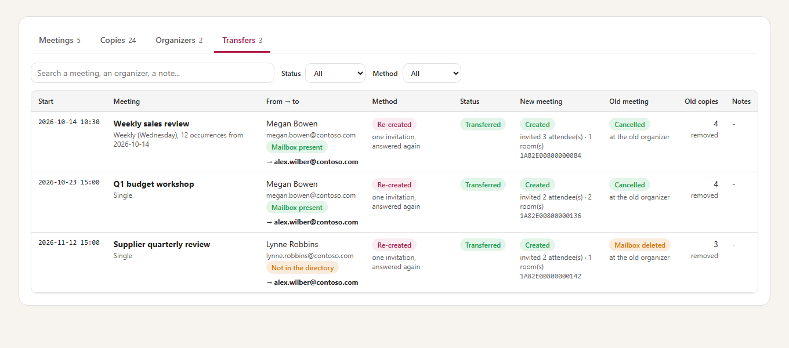

# Meeting Cleanup On-Prem — Developer guide

> Finds the meetings of one or many organizers — whether the mailbox still exists or has been deleted — or **every meeting of some rooms** in **Exchange Server**: one meeting, a series or every meeting of a period, in **every calendar** where they are: the organizer, the rooms, the attendees, the members of the groups invited. Then removes them **silently**, has the organizer **cancel** them, or **transfers** them to a new organizer; a silent removal can be **undone**. EWS and Exchange PowerShell, console, CSV, JSON and HTML reports.

> [!IMPORTANT]
> Files downloaded from the Internet may be blocked by Windows and fail to run. Before using this project, unblock every file in the downloaded folder:
>
> ```powershell
> Get-ChildItem "C:\Chemin\Du\Dossier" -Recurse -File -Force | Unblock-File
> ```
>
> Replace the example path with the folder where you downloaded or extracted this project.

> [!NOTE]
> This is the **developer guide**: how the tool works, the actions in detail, the rights, every setting, the console, the report, the architecture and how to modify and validate the tool. For the prerequisites and the everyday commands only, read the [user guide](MeetingCleanupOnPrem-UserGuide.md).

```cards
user | Organizers present | One address, or a list of them (`-OrganizerFile`); Cancel sends the cancellation with your message and frees the rooms.
ban | Organizers deleted | The meetings are found in the rooms, a list of mailboxes or every mailbox, from the address of the person or its X500 address.
calendar | One meeting, a series, a period | `-Subject`, `-MeetingId`, `-Start` / `-End`. A series is handled as a whole, or by its occurrences in the period (`-SeriesScope Occurrences`).
refresh | Silent, and reversible | *Remove* sends nothing and keeps a backup; *Restore* puts the copies back from Recoverable Items. *Cancel* is the organizer cancelling.
building | Rooms over a period | `-Room` / `-RoomFile`: every meeting of the rooms, whatever its organizer — a room closed for works. A series loses only its occurrences in the period.
people | Transfer to a new organizer | `-Action Transfer -NewOrganizer`: each meeting re-created and sent by the new organizer, the old one cancelled or removed.
```

## Quick start

```steps
Install | Copy the folder, unblock the files, check PowerShell 7.4 or later (chapter 6).
Service account | An account with ApplicationImpersonation (limited by a management scope), remote PowerShell and the read-only roles of the directory (chapter 5).
Configure | EWS URL, service account, Exchange PowerShell server and accepted domains in `config\MeetingCleanupOnPrem.config.psd1` (chapter 7).
Report | `.\Invoke-MeetingCleanupOnPrem.ps1 -Organizer john.doe@contoso.com` lists the meetings of the coming year and every copy of them. Nothing is changed.
Act | Read the report, then the same command with `-Action Cancel` or `-Action Remove` (or `-FromReport <folder>` for exactly the meetings reviewed).
Undo | `-Action Restore -FromReport <folder of the Remove run>` puts the removed copies back, without a message (chapter 4; rights in chapter 5).
Rooms, transfer | `-Room <rooms> -Start -End -Action Cancel` empties rooms over a period; `-Action Transfer -NewOrganizer <address>` gives the meetings of a leaver to someone else (chapter 4).
```

> [!IMPORTANT]
> Always start with a **report** (the default action). Removed copies cannot be restored by the users; the tool can (*Restore*), for the retention of deleted items (14 days by default). A **cancellation cannot be undone**: the attendees received it.

# Part I · Understand

<!-- icon: target -->
## 1. Purpose

Meetings outlive the people and the decisions behind them. A person leaves and their weekly meetings keep booking the rooms; an organizer deletes a meeting without sending the cancellation and it stays in every attendee's calendar; a mailbox is deleted and its meetings can no longer be cancelled by anyone. In each case the meeting exists in many mailboxes, and each copy has to be found and removed.

Meeting Cleanup On-Prem is the **Exchange Server** counterpart of [Meeting Cleanup](https://github.com/Nico77600/MeetingCleanup) (Exchange Online): the same search, the same actions, the same report and console, through **EWS** (the calendars) and **Exchange PowerShell** (the directory, the groups and Recoverable Items) instead of Microsoft Graph.

```cards
search | Found everywhere | One copy of a meeting holds its whole attendee list: every internal attendee, room and group member is then asked for its own copy, by its UID.
shield | Nothing by surprise | The report is the default. Remove, Cancel, Transfer and Restore say exactly what will happen and ask to confirm.
check | Verified | Each copy removed is read again; the report gives the answer of Exchange for every request.
refresh | Replayable, reversible | `-FromReport` acts on the meetings of a reviewed report; a backup is written before any change, and *Restore* undoes a *Remove*.
```

The tool reads and changes calendars only. It never reads a message other than a calendar item, and it changes no setting of Exchange or Active Directory.

<!-- icon: flow -->
## 2. How it works

```flow
user | Organizer | addresses, X500
arrow | where | 
search | Mailboxes | organizer, rooms, list, all
arrow | period | series too
calendar | Search | CalendarView
arrow | UID | in every copy
people | Attendees | rooms, groups
arrow | confirm | 
trash | Action | remove, cancel, transfer
```

| Stage | What happens |
|---|---|
| **Organizer** | The addresses of each organizer (primary, aliases, X500 / legacyExchangeDN) from `Get-Recipient`, and whether it is a mailbox. Without Exchange PowerShell, the address typed only. A list of organizers is searched in one pass: each mailbox is read once for all of them. *Rooms mode*: no organizer, the rooms given are the place to search, every meeting found there is kept. |
| **Mailboxes** | Where to search (`-SearchIn`): the organizer's calendar, every room mailbox (`Get-Mailbox -RecipientTypeDetails RoomMailbox`, and `Search.Rooms`), a list of mailboxes, every mailbox of the organization. |
| **Search** | In each mailbox, a **CalendarView** of the period (every occurrence of a series, page after page), then one **GetItem** per meeting for its details (50 items per call): organizer, attendees, rooms, recurrence, body. The organizer is compared on this side; a series is one meeting with its occurrences in the period. |
| **Attendees** | For each meeting, its best copy gives the subject and the attendee list; every internal attendee, room and member of an invited group (expanded with `Get-DistributionGroupMember`) is asked for its copy by **UID** (the same in every copy of a meeting). Each attendee mailbox is read once for all its meetings. External attendees (outside `Search.AcceptedDomains`) and X500 addresses are listed, not processed. |
| **Backup** | Before Remove, Cancel or Transfer: every meeting in full (subject, body, attendees, rooms, recurrence, time zone) and the state of each copy in `Backup.json`, in the folder of the run. |
| **Action** | Remove, Cancel or Transfer (chapter 4), then each copy removed is read again. *Restore* puts back the copies of a Remove run. |
| **Report** | CSV, JSON and HTML in a new folder; a daily log. |

<!-- icon: layers -->
## 3. The cases

Every case is the same command: what changes is the organizer state, what is searched and where.

| Case | Command (add `-Action Remove` or `-Action Cancel` once the report is reviewed) |
|---|---|
| **One meeting**, still in the organizer's calendar | `-Organizer <address> -Subject 'Weekly review'` |
| **One meeting** no longer in the organizer's calendar (deleted without cancellation) | `-Organizer <address> -Subject 'Weekly review' -SearchIn Rooms` — or `Mailboxes`, `AllMailboxes` when it had no room |
| **A series**, present or not at the organizer | the same: a series is one meeting, handled as a whole |
| **One or some occurrences of a series** | `-Organizer <address> -Subject 'Weekly review' -SeriesScope Occurrences -Start 2026-11-16 -End 2026-11-16` |
| **A period**, organizer present | `-Organizer <address> -Start 2026-11-01 -End 2026-12-31` |
| **A period**, organizer deleted | `-Organizer <old address or X500> -SearchIn Rooms` then, for the meetings without room, `-SearchIn Mailboxes -MailboxFile .\team.txt` or `-SearchIn AllMailboxes` |
| **A meeting chosen in a report** | `-Organizer <address> -MeetingId <MeetingId of the report>`, or `-FromReport <folder> -MeetingId <id>` |
| **Several organizers** (leavers of the month, a team) | `-OrganizerFile .\leavers.txt` (or `-Organizer a@contoso.com, b@contoso.com`) with any of the cases above |
| **Undo a Remove** | `-Action Restore -FromReport <folder of the Remove run>` |
| **Every meeting of some rooms** over a period (works, closed floor) | `-Room room-paris-01@contoso.com, room-paris-02@contoso.com -Start 2026-11-02 -End 2026-11-13` (or `-RoomFile`) — then `-Action Cancel -Comment '...'` |
| **Give the meetings of a person to someone else** | `-Organizer <address> -Action Transfer -NewOrganizer <address>` |

The default search is the organizer's calendar and the rooms (`Search.SearchIn`), over the coming year (`Search.PastDays`, `Search.FutureDays`).

> [!TIP]
> A deleted organizer whose meetings had no room can only be found in the attendees' calendars: give the team in a file (`-SearchIn Mailboxes -MailboxFile`), or search every mailbox (`-SearchIn AllMailboxes`). Its meetings still carry its **X500 address** (legacyExchangeDN) when the account is gone: give that one.

<!-- icon: compare -->
## 4. The actions

The EWS requests of the tool, and what Exchange Server does with them (lab, Appendix C):

| Request | Messages sent | Effect |
|---|---|---|
| Remove the copy of an **attendee** or a **room** (`DeleteItem`, `SoftDelete`, `SendMeetingCancellations="SendToNone"`) | **none** — no response to the organizer | the copy goes to **Recoverable Items\Deletions**: gone for the user, restorable |
| **Cancel** by the organizer (`CreateItem` of a `CancelCalendarItem`, `SendAndSaveCopy`) | the cancellation with your message | the rooms remove their copy themselves (*Already gone* for the tool); the attendees see the cancellation |
| **Create** a meeting in the new organizer's calendar (`CreateItem`, `SendToAllAndSaveCopy`) | **one invitation** to every attendee and room | the rooms book it (auto-accept) |

So the actions are:

| Action | Organizer's meeting | Attendees and rooms | Messages |
|---|---|---|---|
| **Remove** (silent) | **left as it is** (*Kept*): the organizer keeps a consistent meeting he can still cancel | copies removed | none |
| **Cancel** (and clean) | cancelled, with the message of `-Comment` (`Cleanup.CancelComment`) | copies left after the cancellation removed | the cancellation, to every attendee |
| **Transfer** | re-created by the new organizer; the old one cancelled by its organizer (or removed silently when the mailbox is gone) | one new invitation; the old copies removed silently | the invitation, and the cancellation of the old organizer |
| **Restore** | — | the copies of a Remove run put back from Recoverable Items | **none** |

- A meeting **no longer in the organizer's calendar**, or whose organizer is deleted, cannot be cancelled: with *Cancel* its copies are removed silently, and the report says so.
- If the cancellation fails, the copies of that meeting are left untouched (**Not done**), so that the meeting stays consistent. A meeting whose organizer copy exists but cannot be read is not acted on (*Skipped*).
- A series is cancelled or removed as a whole, past occurrences included — unless it is limited to its occurrences in the period (*Occurrences of a series*, below, and the rooms mode).
- The copies with the **same subject in one mailbox** (a room shows the organizer's name as subject) are removed **3 seconds apart**: their order is then certain in Recoverable Items, for the restore.

### Occurrences of a series

`-SeriesScope Occurrences` (`Search.SeriesScope`) limits each series found to **its occurrences in the period**, as the rooms mode does, but for the meetings of organizers and without any room. With a period of one day, one occurrence.

- The occurrences are those of the **organizer's calendar**; when the organizer has no mailbox any more, those of the copies of the attendees and the rooms. Each copy (organizer, attendees, rooms) is replaced by its occurrences of the period, each with its own item ID; the copies of the other occurrences are left out.
- *Cancel*: the organizer cancels these occurrences only — **one cancellation per occurrence** (`CancelCalendarItem` of the occurrence), with your message, to every attendee; the rooms remove the occurrence themselves — then the copies left are removed. *Remove*: these occurrences go from the attendees' and the rooms' calendars without any message; the organizer keeps them. The series goes on before and after.
- A series whose every occurrence is in the period is still acted on occurrence by occurrence (a note says so): `-SeriesScope Whole` cancels it at once.
- With an action, the period must be given (`-Start` and `-End`). An occurrence removed is **not restorable** (Exchange does not keep it in Recoverable Items: `Backup.json` lists it). *Transfer* moves whole series: not available by occurrences.
- When the calendar of the organizer cannot be read (other than a mailbox that no longer exists), the series is left as it is (*Not processed*): never the attendees without their organizer, never the whole series.
- The report keeps the column *OccurrencesSkipped* of Meeting Cleanup (the occurrences left out in its window): a replay (`-FromReport`) leaves out the occurrences listed in `SkippedOccurrences` of its `Summary.json` (copies *Skipped*). The tool itself has no window: it is 0 in its own reports.

Measured in the lab (2026-10-07, Appendix C): one occurrence of a weekly series of 4 cancelled from the command line — gone at the organizer, the attendee and the room, **one** *Canceled:* received for that date, the three others intact.

### Rooms over a period

`-Room` (or `-RoomFile`) searches the rooms given and keeps **every meeting** found there in the period, whatever its organizer. Each meeting is then found everywhere, as always (attendees, other rooms, group members). Typical: a floor closed for works, a room taken out of service.

- **A series is limited to its occurrences in the period**: each copy (organizer, attendees, rooms) is replaced by its occurrences of the period, each with its own item ID. *Cancel* cancels these occurrences only (one cancellation each, with your message); *Remove* takes them out of the attendees' and the rooms' calendars. The series goes on before and after. Only the occurrences **the rooms hold** count.
- With an action, the period must be given (`-Start` and `-End`).
- **An occurrence removed is not restorable** by the tool: `Backup.json` lists it. Single meetings removed are restorable as usual.
- *Transfer* is for the meetings of organizers: not available in rooms mode.

### Transfer to a new organizer

`-Action Transfer -NewOrganizer <address>` gives the meetings found to another person, who becomes their organizer. Exchange Server has no supported way to change the organizer of a meeting (Exchange Online has `Invoke-ChangeMeetingOrganizer`, not Exchange Server): each meeting is **re-created** by the new organizer (`Transfer.Method = 'Recreate'`, the only method).

```steps
Read | The meeting in full from its best copy (organizer, else an attendee, else a room): subject, body, location, attendees, rooms, recurrence and its time zone; for a series, its occurrences still to come.
Rooms | The old copies of the rooms are removed (silent): their slots are free for the new meeting.
Create | The meeting is created in the new organizer's calendar and sent to every attendee and room: **one invitation**. A series starts with its next occurrence, with the same pattern; a numbered series keeps the number of occurrences still to come. The body starts with the message `Transfer.Comment`.
Old meeting | When the old organizer still has his meeting, he cancels it with the message `Transfer.Comment` ("This meeting is now organized by ..."); the copies left are removed silently.
Verify | The old copies are read again (gone), and the new meeting in the new organizer's calendar (present).
```

- If the creation fails, the meeting is *Failed* and nothing more is changed; old room copies already removed come back with `-Action Restore -FromReport <transfer report>`.
- The transfer moves the meeting **from now**: the old meeting goes whole, its past occurrences included (they are in `Backup.json`). The **exceptions** of the old series (an occurrence moved or cancelled) are not carried over.
- Not transferred (*Skipped*, with the reason): a meeting already organized by the new organizer, already transferred by the report replayed, cancelled, already over, or a series without an occurrence to come in the period.
- A transfer starts from a search of organizers (a rooms search is refused), or from a report (`-FromReport`): the meeting is then read again through EWS.
- The new organizer must have a mailbox that the service account can open through EWS.
- The report opens on its **Transfers** tab (chapter 10).

### Undo a Remove: Restore

A copy removed by the tool is not gone at once: Exchange keeps it in **Recoverable Items\Deletions** of the mailbox for the retention of deleted items (**14 days** by default; as long as a hold lasts). *Restore* puts it back, as it was:

```powershell
.\Invoke-MeetingCleanupOnPrem.ps1 -Action Restore -FromReport .\reports\MeetingCleanupOnPrem_Remove_20261006-001346
```

```flow
file | Report | Remove run
arrow | EWS | 
check | Already back? | UID
arrow | Exchange | PowerShell
refresh | Recoverable Items | Deletions
arrow | verify | 
calendar | Calendar | as it was
```

| Step | What happens |
|---|---|
| **Copies to restore** | From the `Summary.json` of the run: the copies with the result *Removed*, with the time each one was removed. |
| **Already back?** | Each calendar is read once (from 30 days ago to 400 days ahead): a copy already there (put back by someone, or a second restore) is *Already present*. |
| **Recoverable Items** | `Get-RecoverableItems -FilterItemType IPM.Appointment` lists the meetings removed in each mailbox around the time of the removal (± `Restore.WindowMinutes`). The copy is found by its subject (a room shows the organizer's name) and the time of its removal; when one mailbox has several copies with the same subject, by the order of the removals (*Remove* leaves 3 seconds between them). `Restore-RecoverableItems -EntryID` puts back that very item in its calendar. |
| **Verify** | Each calendar is read again: the copy is there, with its answer. |

- **No message** is sent, to anyone: the attendees find the meeting in their calendar, as before. The copy keeps its answer: an **accepted room is busy again** (measured, Appendix C).
- **A restore never removes anything.** When the item of a copy is not certain — the items with its subject in Recoverable Items are not exactly the copies the run removed there, or two of them have the same second — nothing is restored for that subject in that mailbox: the copy is *Failed*, with the `Get-RecoverableItems` command to do it by hand.
- **A cancellation cannot be undone**: the attendees received it. The cancelled and the transferred meetings are *Not restorable*.
- Without Exchange PowerShell, `Restore.Mode = 'Ews'` reads Recoverable Items through EWS (page after page) and moves the item back (`MoveItem`): a fallback, the cmdlets are the recommended way.
- The **backup** (`Backup.json`, written before any change) holds every meeting in full and the state of each copy: what was there, even after the retention of deleted items.

# Part II · Set up

<!-- icon: key -->
## 5. Rights and connection

The tool signs in with **one service account**: EWS for the calendars (it opens the mailbox of each organizer, attendee and room), Exchange PowerShell for the directory and the restore.

| Access (`Connection.AccessMode`) | Rights | When |
|---|---|---|
| `Impersonation` (default) | The role **ApplicationImpersonation**, limited by a management scope | Every case: the account acts as each mailbox, one EWS header per request. |
| `Delegate` | **Full access** on each mailbox searched or changed | A few known mailboxes only. |
| `Self` | The account's own mailbox | Tests. |

```powershell
# Exchange Management Shell, as an Exchange administrator - once
New-ManagementScope -Name 'Meeting Cleanup scope' -RecipientRestrictionFilter "RecipientTypeDetails -eq 'UserMailbox' -or RecipientTypeDetails -eq 'RoomMailbox' -or RecipientTypeDetails -eq 'SharedMailbox'"
New-ManagementRoleAssignment -Name 'Meeting Cleanup impersonation' -Role ApplicationImpersonation -User svc-meetingcleanup -CustomRecipientWriteScope 'Meeting Cleanup scope'
```

| Authentication (`Connection.Authentication`) | How |
|---|---|
| `Windows` (default) | The account that runs the tool, or the credential of `Connection.CredentialFile` / `Connection.CredentialUser`. `Connection.WindowsPackage`: `Negotiate` (Windows chooses), `NTLM` (when Kerberos to the name of the EWS URL fails on the server: no alternate service account), `Kerberos`. |
| `Basic` | Only where the EWS virtual directory still accepts it: the password is asked (`Connection.CredentialUser`) or read from the credential file. |

`Connection.CredentialFile` is a `PSCredential` saved with `Export-Clixml` by the account that runs the tool (DPAPI: only that account, on that computer, can read it). It is needed in a scheduled task, and wherever the session has no single sign-on (Credential Guard blocks NTLM single sign-on in a batch logon).

`Connection.EwsServer` sends the requests to one server (name or IP) while keeping the name of the URL for TLS and the `Host` header: needed when the tool runs on a server behind a load balancer that cannot send the server back to itself (hairpin).

### Rights for the directory

Exchange PowerShell is optional but recommended (`Search.DirectoryMode = 'Auto'`): without it, aliases and X500 addresses are not resolved, the rooms come from `Search.Rooms` only, `AllMailboxes` and the groups are not available, and the restore uses EWS.

| `ManagementShell.Mode` | Behaviour |
|---|---|
| `Rps` (default) | The tool opens a remote PowerShell session to `http://<ServerFqdn>/PowerShell/` (`Microsoft.Exchange`, Kerberos by default) and imports the cmdlets; it closes it at the end. |
| `Auto` | The Exchange cmdlets of the current session when present (Exchange Management Shell), else remote PowerShell. |
| `Existing` | Only the cmdlets of the current session. |

The cmdlets used and their roles: `Get-Recipient`, `Get-Mailbox`, `Get-DistributionGroupMember` (read only: *View-Only Recipients*, for example in **View-Only Organization Management**). The account needs remote PowerShell (`Set-User -RemotePowerShellEnabled $true`).

```powershell
Set-User svc-meetingcleanup -RemotePowerShellEnabled $true
Add-RoleGroupMember 'View-Only Organization Management' -Member svc-meetingcleanup
```

### Rights for Restore

`Get-RecoverableItems` and `Restore-RecoverableItems` need the role **Mailbox Import Export**, in no role group by default. Give it to the account only where restores are run, or the day a restore is needed:

```powershell
New-RoleGroup -Name 'Meeting Cleanup Restore' -Roles 'Mailbox Import Export' -Members svc-meetingcleanup
```

A new role applies to a new session: run the tool again (it opens its own remote PowerShell session).

<!-- icon: download -->
## 6. Installation

| Need | Detail |
|---|---|
| PowerShell | **7.4 or later**. A portable zip is enough. |
| Windows | Windows 10 / 11, Windows Server 2016 to 2025: an administration workstation or an Exchange server. |
| Modules | **None**: EWS is called directly (SOAP over HTTPS, no EWS Managed API), Exchange PowerShell through remote PowerShell. |
| Network | HTTPS to the EWS URL; HTTP (Kerberos) to `/PowerShell/` of a Mailbox server. |

Copy the folder, then unblock the files downloaded from the Internet:

```powershell
Get-ChildItem 'C:\Tools\MeetingCleanupOnPrem' -Recurse -File -Force | Unblock-File
```

The first run of a version compiles its helper (`src\MeetingCleanupOnPrem.Native.cs`) — a few seconds, up to a minute on a busy Exchange server — and keeps it in `%LOCALAPPDATA%\MeetingCleanupOnPrem` of the account: the next runs load it at once.

<!-- icon: settings -->
## 7. Configuration

`config\MeetingCleanupOnPrem.config.psd1` is a PowerShell data file. Every value is checked at start and all the problems are listed at once; the parameters of the command line override it for one run.

| Setting | Default | Meaning |
|---|---|---|
| `Connection.EwsUrl` | | `https://<server>/EWS/Exchange.asmx` (`Discovery = 'Manual'`). |
| `Connection.Discovery` | `Manual` | `Manual` or `Autodiscover` (from `Connection.Mailbox`). |
| `Connection.Mailbox` | | The address of the service account (impersonation, delegate). |
| `Connection.AccessMode` | `Impersonation` | `Impersonation`, `Delegate` or `Self` (chapter 5). |
| `Connection.Authentication` · `WindowsPackage` | `Windows` · `Negotiate` | `Windows` or `Basic`; `Negotiate`, `NTLM` or `Kerberos`. |
| `Connection.CredentialUser` · `CredentialFile` | | An account whose password is asked · a credential file (`Export-Clixml`). Empty: the account that runs the tool. |
| `Connection.RequestServerVersion` | `Exchange2016` | `Exchange2013_SP1`, `Exchange2016` or `Exchange2019`. |
| `Connection.MaxRetries` · `TimeoutSeconds` | `3` · `120` | Requests sent again when Exchange is busy (throttling) or unavailable · timeout of a request. |
| `Connection.PageSize` | `500` | Items of a calendar page (10-1,000). A calendar is read page after page. |
| `Connection.EwsServer` | | One server to send the requests to, the name of the URL kept (load balancer, chapter 5). |
| `Search.SearchIn` | `Organizer`, `Rooms` | Default of `-SearchIn`. |
| `Search.PastDays` · `FutureDays` | `0` · `365` | Default period: today minus *PastDays* to today plus *FutureDays* (included). |
| `Search.SeriesScope` | `Whole` | `Whole`: a series acted on whole; `Occurrences`: only its occurrences in the period (chapter 4). Rooms mode always acts on the occurrences of the period. |
| `Search.Rooms` · `RoomFile` | | Rooms added to those of Exchange PowerShell (or the only ones without it). |
| `Search.Mailboxes` · `MailboxFile` | | Default mailboxes of the `Mailboxes` scope. |
| `Search.AcceptedDomains` | | The domains of the organization: an attendee of another domain is external (listed, not processed). Empty: every address is looked up. |
| `Search.DirectoryMode` | `Auto` | `Auto` or `ExchangePowerShell`: the cmdlets when present; `None`: never. |
| `Search.AllRooms` | `$true` | `$true`: every room mailbox of Exchange PowerShell, with `Rooms` and `RoomFile`; `$false`: `Rooms` and `RoomFile` only — when the impersonation is limited to some rooms (a room outside its scope is not read: warning). |
| `ManagementShell.Mode` | `Rps` | `Rps`, `Auto` or `Existing` (chapter 5). |
| `ManagementShell.ServerFqdn` · `ConnectionUri` | | Server of remote PowerShell · its URL (empty: `http://<ServerFqdn>/PowerShell/` with Kerberos). |
| `ManagementShell.Authentication` · `CredentialUser` | `Kerberos` | `Kerberos`, `Negotiate` or `Basic` · another account for remote PowerShell (its password is asked). |
| `Cleanup.CancelComment` | *This meeting has been cancelled by the IT department.* | Message of *Cancel* (plain text). |
| `Cleanup.Verify` | `$true` | Read each removed copy again. |
| `Restore.Mode` | `Auto` | `Auto` (Exchange PowerShell when present, else EWS), `ExchangePowerShell` or `Ews`. |
| `Restore.WindowMinutes` | `10` | Tolerance around the time of each removal, to find it in Recoverable Items. |
| `Transfer.Method` · `Comment` | `Recreate` · *This meeting is now organized by {0}.* | The only method on Exchange Server · message of the old organizer (`{0}` = the new organizer). |
| `Report.OutputPath` · `FilePrefix` · `Formats` · `CsvDelimiter` | `.\reports` · `MeetingCleanupOnPrem` · `Csv`, `Html` · `;` | Report files (a `Summary.json` is always written). |
| `Report.TimeZone` | *Windows* | Time zone of the dates typed and shown (`Romance Standard Time`, `Europe/Paris`...). |
| `Logging.Path` · `RetentionDays` | `.\logs` · `30` | One log file per day. |

A file of mailboxes (`-MailboxFile`, `Search.MailboxFile`, `Search.RoomFile`) is a text file with one address per line (`#` = comment), or a CSV file with a column `PrimarySmtpAddress`, `EmailAddress`, `Mail`, `WindowsEmailAddress`, `UserPrincipalName` or `Address` — for example the export of `Get-Mailbox | Select-Object PrimarySmtpAddress`. A file of organizers (`-OrganizerFile`) is the same, and also accepts X500 addresses and the column `Organizer`.

# Part III · Use

<!-- icon: terminal -->
## 8. Command line

| Parameter | Meaning |
|---|---|
| `-Organizer` | SMTP address (any alias), or the X500 address (legacyExchangeDN) of a deleted mailbox. Several organizers may be given. |
| `-OrganizerFile` | A list of organizers: text file (one address per line) or CSV file (chapter 7). Added to `-Organizer`. |
| `-Room` · `-RoomFile` | Rooms mode: every meeting of these rooms in the period, whatever its organizer (instead of `-Organizer`). With an action, `-Start` and `-End` are required. |
| `-Start` · `-End` | The period, in `Report.TimeZone`; an end date without a time is included. |
| `-Subject` | Only the meetings whose subject contains this text (`*` and `?` are wildcards). The real subject is used, not the organizer's name a room shows. |
| `-SeriesScope` | `Whole` (default, `Search.SeriesScope`): a series is acted on whole. `Occurrences`: only its occurrences in the period (chapter 4); with an action, give `-Start` and `-End`. |
| `-MeetingId` | Only these meetings (column *MeetingId* of the report: the UID). |
| `-SearchIn` | `Organizer`, `Rooms`, `Mailboxes`, `AllMailboxes`. |
| `-Mailbox` · `-MailboxFile` | The mailboxes of the `Mailboxes` scope. |
| `-Action` | `Report` (default), `Remove`, `Cancel`, `Transfer`, `Restore` (with `-FromReport` of a Remove, Cancel or Transfer run). |
| `-Comment` | Message of the cancellation; with `Transfer`, the message of the old organizer (`{0}` = the new organizer). |
| `-NewOrganizer` | *Transfer*: the new organizer (a mailbox the service account can open). |
| `-FromReport` | Folder (or `Summary.json`) of a report: act on exactly its meetings, without a new search. With `Restore`: the run to undo. |
| `-Force` | No confirmation (scheduled task, script). Without it, Remove, Cancel, Transfer and Restore show the plan and ask to type **YES**. |
| `-NoReport` | No CSV and no HTML (an action still writes its backup and `Summary.json`). |
| `-EwsUrl` · `-EwsMailbox` · `-Authentication` · `-AccessMode` · `-CredentialUser` | Overrides of the connection. |
| `-ManagementShellMode` · `-ManagementShellServer` · `-ManagementShellUri` · `-ConfigPath` | Overrides of Exchange PowerShell and of the configuration file. |

```powershell
# What is there? (nothing is changed)
.\Invoke-MeetingCleanupOnPrem.ps1 -Organizer megan.bowen@contoso.com

# Megan has left but her mailbox is kept: cancel her meetings with a message, clean every calendar
.\Invoke-MeetingCleanupOnPrem.ps1 -Organizer megan.bowen@contoso.com -Action Cancel -Comment 'Megan Bowen has left: this meeting is cancelled.'

# One series, removed silently from the attendees and the rooms
.\Invoke-MeetingCleanupOnPrem.ps1 -Organizer megan.bowen@contoso.com -Subject 'Weekly sales review' -Action Remove

# Deleted mailbox: rooms first, then every mailbox for the meetings without room
.\Invoke-MeetingCleanupOnPrem.ps1 -Organizer john.doe@contoso.com -SearchIn Rooms, AllMailboxes -Start 2026-10-01 -End 2027-03-31

# Act on exactly what was reviewed
.\Invoke-MeetingCleanupOnPrem.ps1 -FromReport .\reports\MeetingCleanupOnPrem_Report_20261005-201500 -Action Remove

# Undo a Remove: the copies come back, without a message
.\Invoke-MeetingCleanupOnPrem.ps1 -Action Restore -FromReport .\reports\MeetingCleanupOnPrem_Remove_20261005-203000

# Two rooms closed for works: every meeting of the period cancelled by its organizer (an occurrence for a series)
.\Invoke-MeetingCleanupOnPrem.ps1 -Room room-paris-01@contoso.com, room-paris-02@contoso.com -Start 2026-11-02 -End 2026-11-13 -Action Cancel -Comment 'The rooms of the 1st floor are closed for works.'

# Not this Monday: one occurrence of a weekly series cancelled, the series goes on
.\Invoke-MeetingCleanupOnPrem.ps1 -Organizer megan.bowen@contoso.com -Subject 'Weekly sales review' -SeriesScope Occurrences -Start 2026-11-16 -End 2026-11-16 -Action Cancel -Comment 'No sales review this Monday.'

# John has left: Jane organizes his meetings from now on (re-created, one invitation)
.\Invoke-MeetingCleanupOnPrem.ps1 -Organizer john.doe@contoso.com -Action Transfer -NewOrganizer jane.roe@contoso.com
```

Exit codes: `0` completed, `1` failed (nothing done after the first error), `2` finished with warnings (a copy not removed, a mailbox not read, a calendar read in part).

More examples, one per everyday question: [user guide, chapter 2](MeetingCleanupOnPrem-UserGuide.md#2-everyday-use).

<!-- icon: play -->
## 9. Console



The console of Meeting Cleanup: a title card with the request and the connection, numbered steps, one line per result with an icon, the table of the meetings, and a final card with the status, the counts, the report, the log and **the next command to run**.



In an interactive console, each long step shows a live line, rewritten in place: a bar, the part done, what it counts (mailboxes searched, attendee mailboxes, copies removed, verified or restored, meetings cancelled or re-created) and the **time left**, told from the speed of the step once it has run 2 s and 2 %, rounded as a person would say it.

- Colours are off when the output is redirected (scheduled task, `> file`) or when `NO_COLOR` is set; `MCO_FORCE_COLOR=1` forces them.
- Icons: emoji in Windows Terminal and VS Code, symbols of the classic console fonts elsewhere; `MCO_ICONS = Emoji | Symbols | Ascii` forces a style.
- Every line also goes to the log of the day (`logs\MeetingCleanupOnPrem_<yyyyMMdd>.log`), without colours or icons, with the confirmations and the requests sent again.
- Numbers and dates are written the same way whatever the culture of Windows (`1,254`, `2026-10-06 10:00`).

<!-- icon: chart -->
## 10. Reading the report



The header gives the action, the period, the tiles (meetings, copies, rooms, not processed) and the warnings; **Search** says who was searched, where and with which connection; the **Meetings**, **Copies** and **Organizers** tabs can be searched and sorted, and a meeting opens its copies. The report follows the light or dark theme of the reader.

A *Transfer* report has a fourth tab, **Transfers**, open first: one row per meeting of the transfer, to read the change of organizer at a glance.



| Column | Content |
|---|---|
| **From → to** | The old organizer, the state of his mailbox (*Mailbox present*, *No mailbox*, *Not in the directory*, *Not checked* without Exchange PowerShell), and the new organizer. |
| **Method** | *Re-created*: one invitation from the new organizer, answered again. |
| **Status** | *Transferred*, *Partial* (an old copy not removed: some attendees may see the meeting twice), *Failed*, *Skipped*. |
| **New meeting** | *Created*, with the number of attendees and rooms invited, and the end of its UID. |
| **Old meeting** | What became of the old meeting at the old organizer: *Cancelled* (with the message), or its state when it had no copy there. |
| **Old copies** | The old copies of the attendees and the rooms removed, the failures and those left. |
| **Notes** | Why a meeting was not transferred, or what went wrong. |

Filters: status and method. A row opens the meeting and every copy (role *New organizer* for the new meeting). The same rows are in `MeetingCleanupOnPrem-Transfers.csv`.

| Meeting status | Meaning |
|---|---|
| **Found** | Report only. |
| **Removed** | Every copy of the attendees and the rooms removed (or already gone); the organizer's meeting *Kept*. |
| **Cancelled** | Cancelled by the organizer, the copies left removed. |
| **Partial** · **Failed** | Some · all requests failed: the copy rows give the Exchange error. |
| **Skipped** | Not selected, or left as it is (*Notes*): its organizer's copy could not be read (*Cancel*), already over or already transferred (*Transfer*). |
| **Restored** | *Restore*: every copy removed by the run is back (or was already). |
| **Not restorable** · **Nothing to do** | *Restore*: cancelled by the organizer or transferred · no copy was removed by the run. |
| **Transferred** | *Transfer*: the meeting is now organized by the new organizer (columns *NewOrganizer*, *NewMeetingId*). |

| Copy result | Meaning |
|---|---|
| *Removed* · *Cancelled* | Done; *Verified* = *Yes* when the copy was read again and is gone (or cancelled). |
| *Already gone* | Not in the calendar any more (a room that processed the cancellation, a user who removed it). |
| *Kept* | The organizer's meeting with *Remove*. |
| *Expanded* | A distribution group: its members are listed below it (*Found by: Group <address>*). |
| *Not found* | No copy of this meeting in the mailbox (declined and removed, never received); with *Restore*: not in Recoverable Items. |
| *Not processed* | External (outside `Search.AcceptedDomains`), an X500 address, no mailbox with this address, or access denied (*Detail*); or a copy left as it is with its meeting. |
| *Not done* | The cancellation failed: the copy was left as it was. |
| *Failed* | The Exchange error is in *Detail*. |
| *Restored* | Back in the calendar, verified, with its answer (*Detail*). |
| *Already present* | Already in the calendar before the restore: left as it is. |
| *Not restorable* | An occurrence of a series (rooms mode, `-SeriesScope Occurrences`): see `Backup.json`. |
| *Skipped* | An occurrence left out of a reviewed report (`SkippedOccurrences`): left as it is. |
| *Created* | *Transfer*: the new meeting in the new organizer's calendar (role *New organizer*). |

<!-- icon: file -->
## 11. Files produced

One folder per run, `<FilePrefix>_<Action>_<yyyyMMdd-HHmmss>`:

| File | Content |
|---|---|
| `MeetingCleanupOnPrem-Meetings.csv` | One row per meeting: UID, subject, organizer, start, series (*Scope* `Occurrences`, their number and *OccurrencesSkipped* when limited to the period), recurrence, organizer copy, copies, status, new organizer and new meeting ID of a transfer. |
| `MeetingCleanupOnPrem-Copies.csv` | One row per mailbox (per occurrence for a series limited to the period, column *Occurrence*): organizer, role, found by, answer, action, result, HTTP status, verified, time of the action, detail, item ID. |
| `MeetingCleanupOnPrem-Organizers.csv` | One row per organizer: address typed, name, state (mailbox, no mailbox, not checked), meetings, series, copies, and what was done (removed, cancelled, restored, transferred, failed). |
| `MeetingCleanupOnPrem-Transfers.csv` | *Transfer* only: one row per meeting of the transfer — old organizer and its state, new organizer, method, status, new meeting (result, UID, attendees and rooms invited), old meeting at the old organizer, old copies removed, failed or left, notes (chapter 10). |
| `MeetingCleanupOnPrem-Summary.json` | The whole result: for scripts, for `-FromReport` and for *Restore*. |
| `MeetingCleanupOnPrem-Backup.json` | Remove, Cancel and Transfer: every meeting in full and the state of each copy, written **before** any change. |
| `MeetingCleanupOnPrem.html` | The dashboard, self-contained (it can be sent alone). |
| `logs\MeetingCleanupOnPrem_<yyyyMMdd>.log` | Every line of the console, the confirmations, the requests sent again. |

CSV files are UTF-8 with BOM; cells starting with `=`, `+`, `-`, `@` are prefixed with an apostrophe (no formula injection in Excel).

# Part IV · Maintain

<!-- icon: layers -->
## 12. Architecture

| File | Role |
|---|---|
| `Invoke-MeetingCleanupOnPrem.ps1` | Entry point: configuration, request, steps, confirmation, exit code. |
| `src\MeetingCleanupOnPrem.Console.ps1` | Console (colours, icons, cards, progress line and time left) and log. |
| `src\MeetingCleanupOnPrem.Config.ps1` | Configuration, request, dates and time zone, files of addresses. |
| `src\MeetingCleanupOnPrem.Ews.ps1` | EWS: HTTP client and authentication, SOAP requests and answers, retries, CalendarView page after page, GetItem by 50, removal, cancellation, creation, Recoverable Items. |
| `src\MeetingCleanupOnPrem.Rps.ps1` · `Exchange.ps1` | Remote PowerShell session; `Get-Recipient`, `Get-Mailbox`, `Get-DistributionGroupMember`. |
| `src\MeetingCleanupOnPrem.Search.ps1` | Organizers, mailboxes to search, search, attendees and groups, totals. |
| `src\MeetingCleanupOnPrem.Cleanup.ps1` | Plan, backup, Remove, Cancel, verification. |
| `src\MeetingCleanupOnPrem.Restore.ps1` | Restore: copies of the run, Recoverable Items, verification. |
| `src\MeetingCleanupOnPrem.Transfer.ps1` | Transfer: plan, re-creation by the new organizer, old meeting, verification. |
| `src\MeetingCleanupOnPrem.Report.ps1` · `templates\Report.template.html` | CSV, JSON and HTML. |
| `src\MeetingCleanupOnPrem.Native.cs` | Compiled helper (C#, `Add-Type`, kept in `%LOCALAPPDATA%\MeetingCleanupOnPrem`): calendar items of the EWS answers, recurrence in words, dates, totals, rows, CSV and JSON of the report. |

**EWS requests.** Every request is a SOAP `POST` to the EWS URL, with the impersonation header of the mailbox and its `X-AnchorMailbox`. A calendar is read with **CalendarView** (few properties, every occurrence); CalendarView has no offset, so while Exchange answers `IncludesLastItemInRange="false"`, the next page starts at the start of the last item received, and the items seen twice are kept once. When more items start at the same time than a page holds, the next page jumps past them and the run ends with a warning. During a search, each CalendarView is kept: an attendee mailbox shared by many meetings is read once. The details come from **GetItem**, 50 items per call (the series master of an occurrence with `RecurringMasterItemId`); a batch refused as a whole is read again item by item. A request that Exchange did not process — `ErrorServerBusy` (throttling, after its `BackOffMilliseconds`) or HTTP 503 — is sent again up to `Connection.MaxRetries` times; after a network error only a read is sent again, never a change.

<!-- icon: clock -->
## 13. Performance and limits

| Measure | Result |
|---|---|
| Simulated organization, 600 meetings, 4,800 copies (`tools\Measure-MeetingCleanupOnPrem.ps1`) | 166 EWS calls (53 CalendarView, 113 GetItem); 12 s; report 1.7 s |
| The same, version 0.3.0 (one CalendarView per meeting and attendee, one GetItem per item) | 8,424 EWS calls, 405 s; report 7.1 s |
| 200 meetings, 20 ms per EWS answer | 8.5 s (0.3.0: 152 s) |
| Lab Exchange 2019, report of one organizer (4 meetings, 16 copies), including remote PowerShell | 63 s, of which about 50 s to open remote PowerShell and EWS (0.3.0: 119 s) |
| Lab, a room of 32 items read in pages of 10 | 4 pages; the same files as one page of 500 |
| Module loaded | 0.3 s; the first run of a version compiles its helper (up to 45 s on a busy lab server) |

- **Exchange Server only**: a mailbox moved to Exchange Online cannot be opened by the on-premises EWS of the impersonated account; it is listed as not processed (use [Meeting Cleanup](https://github.com/Nico77600/MeetingCleanup) there).
- **CalendarView**: more items starting at the same minute in one calendar than `Connection.PageSize` cannot all be read (warning); raise the page size.
- **Occurrences** (rooms mode, `-SeriesScope Occurrences`): an occurrence removed is not restorable by the tool; *Cancel* sends one cancellation per occurrence. In rooms mode, a series is limited to its occurrences in the period held by the rooms. Occurrences cannot be transferred. An occurrence is known by its start in each calendar: an occurrence moved in one calendar only is not matched with the others.
- **Transfer**: the attendees answer again; the old meeting goes whole (past occurrences in `Backup.json`); the exceptions of the old series are not carried over; an online meeting link is not created again.
- **Groups**: a distribution group invited is expanded (nested groups too) with Exchange PowerShell; without it, the group address is looked up as a mailbox and listed as not processed.
- **Restore** depends on Recoverable Items: after the retention of deleted items, or once the item has been purged, it is *Not found* — `Backup.json` still says what was there. Run the restore from the report of the run, not from a later one.
- **Remove** leaves 3 seconds between the copies with the same subject in one mailbox (a room holding many meetings of the organizer): a few seconds more per run, for a restore without doubt.

<!-- icon: beaker -->
## 14. Tests

```powershell
.\Run-Tests.ps1      # Pester 6.1+, a simulated Exchange Server, no network
```

`tests\FakeEws.ps1` is a simulated Exchange Server in memory: calendars with the same UID in every copy, room copies with the organizer's name as subject, series with their occurrences, CalendarView sorted by start and cut at `MaxEntriesReturned` (`IncludesLastItemInRange`), GetItem of one or many items (a series master by its occurrence), DeleteItem to Recoverable Items, cancellation received by every copy (of that occurrence only for an occurrence), creation of a meeting sent to its attendees and rooms, Recoverable Items read by offset and `MoveItem`, a mailbox that does not exist or answers with an error, throttling (`ErrorServerBusy`). `Install-FakeEws` replaces the transport of the module (`Send-McoEwsRequest`), so the retries run as with a real server.

The tests cover the configuration and the request, Exchange PowerShell (recipients, aliases and X500, nested groups, every room, every mailbox — mocked cmdlets), the EWS requests and answers, the compiled parser (property by property against the PowerShell one of 0.3.0), the totals, the CSV cells and the JSON, the progress and the time left, and on the simulated server: a whole search (each mailbox read once, GetItem by 50), paging (and items at the same time beyond a page), the retries, Remove then Restore (Recoverable Items by pages), the replay of a report (Remove, Transfer), Cancel, Transfer with its Transfers tab, the rooms mode, and the series by occurrences (one occurrence cancelled, the others intact; a deleted organizer; an organizer that cannot be read; every occurrence in the period; occurrences left out of a reviewed report; transfer refused).

```powershell
.\tools\Measure-MeetingCleanupOnPrem.ps1 -Meetings 600 -LatencyMs 20 -Show   # a whole search on a simulated organization
.\tools\Measure-MeetingCleanupOnPrem.ps1 -Root <other version> -Out C:\Temp\old  # the same data, to compare two versions
```

<!-- icon: book -->
## 15. Documentation and package

| Guide | Source | For |
|---|---|---|
| **User guide** | `docs\MeetingCleanupOnPrem-UserGuide.md` | The people who run the tool: prerequisites and everyday commands only. |
| **Developer guide** | `docs\MeetingCleanupOnPrem-Guide.md` (this guide) | Everything else: how it works, rights, configuration, console, report, architecture, tests. |

A link from one guide to the other is written with its GitHub anchor (`MeetingCleanupOnPrem-Guide.md#5-rights-and-connection`): GitHub follows it, and the HTML build points it to the HTML file of the other guide.

```powershell
.\tools\New-DocumentationImages.ps1          # console and report images, from the simulated Exchange
.\tools\Build-Documentation.ps1              # both guides in HTML (self-contained, light and dark)
.\tools\New-ReadmeImages.ps1                 # the graphics of the GitHub page (light and dark), after the HTML guides
.\tools\New-MeetingCleanupOnPremPackage.ps1  # package: run-time files and both HTML guides only
```

# Appendices

<!-- icon: lifebuoy -->
## Appendix A - Troubleshooting

| Symptom | Cause and action |
|---|---|
| *Invalid value* (configuration) | Every problem is listed with the setting to change. |
| *EWS could not open the calendar: HTTP 401* | Wrong password, account locked, or Kerberos to the name of the EWS URL failing on the server (IIS 401.1): `Connection.WindowsPackage = 'NTLM'`. In a scheduled task or with Credential Guard: `Connection.CredentialFile`. |
| *EWS GetFolder failed: ... timed out* from an Exchange server | The load balancer sends the request back to the same server (hairpin): `Connection.EwsServer = '<another server or its IP>'`. |
| *ErrorImpersonateUserDenied* · *ErrorAccessDenied* | ApplicationImpersonation missing, or the mailbox outside its management scope. A new assignment can take a few minutes. |
| *ErrorNonExistentMailbox* · *ErrorInvalidSmtpAddress* | No mailbox with this address: deleted, a contact, or an address of another organization. |
| *Exchange RPS connection failed* | `ManagementShell.ServerFqdn` or `ConnectionUri`, Kerberos to `http://<server>/PowerShell/` (use the FQDN, not an alias), `RemotePowerShellEnabled` of the account. `ManagementShell.Mode = 'Existing'` in Exchange Management Shell. |
| *No room to search* | No Exchange PowerShell and `Search.Rooms` empty. |
| A meeting known to exist is not found | Period (a series is found when an occurrence falls in it), address of the organizer (the address shown in the meeting; X500 for a deleted mailbox), or scope: a meeting without room and without organizer copy needs `Mailboxes` or `AllMailboxes`. |
| *more than 500 items at ..., some of them may be missing* | Raise `Connection.PageSize` (up to 1,000). |
| *Confirmation needed: run interactively, or add -Force* | An action without a console (scheduled task): add `-Force`. |
| *Series by occurrences: give the period of the action* | `-SeriesScope Occurrences` (or `Search.SeriesScope`) with *Remove* or *Cancel*: `-Start` and `-End` are required. |
| *Transfer moves whole series* | `-SeriesScope Occurrences` with *Transfer*: use `-SeriesScope Whole`. |
| *Meeting Cleanup On-Prem 1.1.0 is already loaded in this PowerShell session* | The compiled part of another version is loaded in this process (it cannot be unloaded): open a new PowerShell window. |
| *Cannot add type* · *... is not allowed in this language mode* when the module loads | PowerShell runs in *Constrained Language* mode (AppLocker or App Control policy): the tool needs *Full Language* (a folder allowed by the policy, or signed scripts). |
| *Get-RecoverableItems is not available* | The role Mailbox Import Export is missing (chapter 5), or the Exchange cmdlets are not loaded (`ManagementShell`). |
| Restore: copies *Not found* | Retention of deleted items over, copy already restored, or removed by someone else after the run. `Backup.json` says what was there. |
| Restore: *ambiguous, nothing restored* | More items with that subject in Recoverable Items than copies removed by the run: the detail gives the commands to restore it by hand. |
| Transfer: *New organizer ... is not reachable through EWS* | The new organizer must have a mailbox the service account can open (impersonation scope). |
| Transfer *Failed* after the old room copies were removed | `-Action Restore -FromReport <transfer report>` puts the room copies back. |

<!-- icon: shield -->
## Appendix B - Security and recovery

- The password of the service account is never written: it is asked, or read from a credential file encrypted for the account that runs the tool (DPAPI). It never appears in the console, the log or the reports.
- Reports and `Backup.json` contain addresses, subjects and bodies of meetings: store and send them as such.
- The **least rights**: ApplicationImpersonation limited by a management scope to the mailboxes concerned; the read-only roles for the directory; *Mailbox Import Export* only where restores are run (it can be added the day a restore is needed, and removed after).
- A removed copy (`DeleteItem`, `SoftDelete`) is in *Recoverable Items\Deletions* of the mailbox for the retention of deleted items (14 days by default; longer with a hold): *Restore* puts it back (chapter 4). Without the tool, in Exchange Management Shell:

```powershell
Get-RecoverableItems -Identity adele.vance@contoso.com -FilterItemType IPM.Appointment -SubjectContains 'Weekly sales review'
Restore-RecoverableItems -Identity adele.vance@contoso.com -FilterItemType IPM.Appointment -SubjectContains 'Weekly sales review'
```

- A meeting cancelled by the organizer is in its *Deleted Items*; the attendees keep the cancellation message. It cannot be "uncancelled": the organizer sends a new invitation.

<!-- icon: beaker -->
## Appendix C - Lab measurements

A lab Exchange Server 2019 (EWS `V2017_07_11`), four Mailbox servers behind a load balancer, 2026-10-06 and 07: three organizers, three attendees (one only through a distribution group), two rooms (*AutoAccept*); single meetings and series; the tool run by a scheduled task with a service account (impersonation, NTLM, remote PowerShell with Kerberos).

| Test | Observed |
|---|---|
| UID of a meeting | identical in the organizer's, the attendees' and the rooms' copies |
| Copy of a room | subject = the organizer's name; attendee list complete |
| CalendarView with `calendar:UID` and `CalendarItemType` | supported (the tool falls back to GetItem for each item when it is refused) |
| Kerberos to the name of the EWS URL from the servers | refused (IIS 401.1, no alternate service account): NTLM works |
| EWS from a Mailbox server through the load balancer | timeout (hairpin): `Connection.EwsServer` to another server works |
| NTLM single sign-on in a batch logon (Credential Guard) | refused: a credential file works |
| Tool, *Report* of one organizer, 0.3.0 then 1.0 (each in its own process) | the same `Meetings.csv`, `Copies.csv` and `Organizers.csv`; 119 s then 63 s |
| Tool, *Remove* of one meeting from a report (`-FromReport -MeetingId`) | 4 copies removed (3 attendees, 1 room) and verified gone, organizer kept, **no message** |
| Tool, *Restore* of that run (Exchange PowerShell) | 4 copies back and verified; the room *Accept* again, the attendees with their answer; **no message** |
| Tool, *Cancel* of one meeting | 1 cancellation with the message; the room removed its copy itself (*Already gone*); 2 attendee copies removed |
| Tool, *Cancel* of a series and a meeting of another organizer | 2 cancellations; the rooms freed; 3 copies removed |
| Tool, *Transfer* of a series of 4 and a meeting to a new organizer | 2 meetings re-created and sent (one invitation each), the old organizer's 2 cancellations, 5 old copies removed and verified, 15 s |
| Tool, *Transfer* of a daily series of 30 occurrences | re-created from its next occurrence; *Transfers* tab: *Mailbox present*, *Re-created*, *Created* (1 attendee, 1 room invited), old meeting *Cancelled*, 2 old copies removed |
| Tool, rooms mode, 2 rooms over 8 weeks | 4 meetings of 3 organizers; a series limited to its 4 occurrences in the period (12 occurrence copies) |
| Tool, a room of 32 items, pages of 10 then 500 | 4 pages; the same CSV files |
| Module, first run of a version on a busy server | 45 s to compile its helper; then 0.3 s |
| Tool 1.0, `-SearchIn Rooms` with every room of Exchange PowerShell | 5 rooms listed, 3 of them outside the management scope of the impersonation: *ErrorImpersonateUserDenied*, 3 warnings (exit code 2); with `Search.AllRooms = $false`, the 2 rooms of the configuration, no warning |
| Tool 1.0, an organizer address that is not in the directory | `Get-Recipient`: *couldn't be found*; shown *not in the directory*, its calendar not opened, the run completed |
| Tool 1.1, a weekly series of 4 (organizer, an attendee, a room): `-SeriesScope Occurrences` over one day, *Cancel* | 1 occurrence cancelled by the organizer, the room removed it itself (*Already gone*), the attendee's removed and verified; 60 s later the 3 other occurrences intact in the three calendars, **one** *Canceled:* in the attendee's inbox |

<!-- icon: tag -->
## Appendix D - Versions

MAJOR.MINOR.PATCH: MAJOR for a change of configuration or report format, MINOR for a new search or action, PATCH for a fix. Each change is described in `CHANGELOG.md`.
